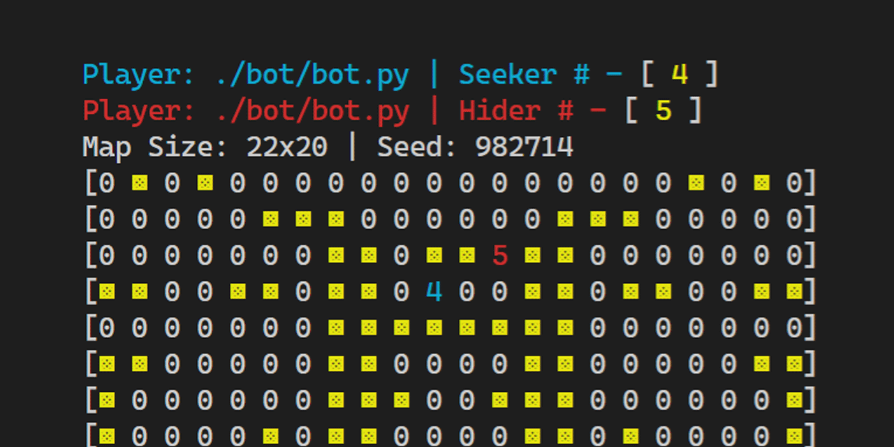

# Hide and Seek Bot: Clairvoyant
- 🥉 Third place submission entry to [the first AI Competition hosted by ACM@UCSD](https://github.com/acmucsd/hide-and-seek-ai).
- Written completely in Python 3 with Python 3.6 type hints, which are removed using [`striphints`](https://github.com/abarker/strip-hints) in the submitted version to be compliant with Python 3.5 on the competition server
## Naming
The bot is named Clairvoyant because it uses a strategy that uses various information from the server to identify the exact location, or at least one of several possible locations, of the opposing party. Using combined information from all units owned by the agent, it can often determine the precise location of some unit of the opposing team even if all opposing units are out of its sight. This seemingly magical clairvoyance lead to its name.
## How does its clairvoyance work?
The key to its psychic ability lies in the `opponent` Python module (`bot/opponent.py`). In this module, opponents are registered as `Opponent` objects at the start of a match, and the number of opponents is determined by the number of units the bot's team own since the number of units should be the same on both teams. The bot uses competition server's IDs to identify opponents. From the server's source code, it is determined that hiders IDs are odd numbers starting from 5 and seeker IDs are even numbers starting from 4. For example, in a 3 seeker and 3 hider map, the seeker IDs are 4, 6, 8 while the hider Ids are 5, 7, 9. The bot tracks all possible map locations of each opponent of the round based on any units in plain sight and the Euclidean squared distance (R^2) to the closest opposing unit for each unit the agent owns. There is a 2D boolean array (`Opponent.possibility_map`) that is used for this task. Especially in situations where there is only one opponent left, this quickly filters out impossible locations so that the bot can focus on the few possible locations where the opponent can possibly be.
### Key Insight: All maps are symmetrical
However, using the strategies above alone is not enough to determine the opponent's location. At the start of the game, it seems that the hider can just be anywhere. But after watching a few matches I realized that its not just the entire map (not just walls but also the initial location of seekers and hiders) is symmetrical for the purpose of fairness. (Relevant code can be found in [src/Map/gen.ts line 27](https://github.com/acmucsd/hide-and-seek-ai/blob/5455e8ee90e93c866c0195472e458a25d0825e0b/src/Map/gen.ts#L27) of the competition's repository) This allowed the bot to calculate the initial spawning location of each opponent based on the detected symmetry of the graph. The bot can even get specific ID numbers corresponding to each location since `<hider ID> = <corresponding seeker ID> + 1` for each symmetrical pair of seeker and hider, since the hider is spawned immediately after the seeker in the code. With the initial location determined, the bot can often track down the exact location of one of the opponent based on the closest opponent distances from all of its owned units, even when the opponent is not in plain sight.
## Seeker Strategy
The seeker relies almost exclusively on the "dowsing" ability of the `opponent` module as described above, and since using `opponent` alone produced great results, I did not add any algorithms to "search" for the opponent or collaborative strategies (like assigning each seeker to a different search location) Each seeker uses a simple <abbr title="Breadth First Search">BFS</abbr> pathing algorithm to find its way to one possible hider location. That is, at each round, it chooses a valid move that would lead to the closest BFS distance to the opponent, and if multiple such moves exist, randomness is used as the tiebreaker when there's multiple possible hider locations, and euclidean (R^2) distance is used when there's only one possible hider location.
## Hider Strategy
After implementing my super-seeker, I almost thought that hiders are impossible to win, since there exist an almost perfect strategy for seekers. Also, the game require the hider to survive for 200 rounds to win, which can be especially hard given the limited map size and the multitude of deadly corners. But it turns out that the hiders may be the one having a perfect strategy, at least in 1 to 1 matches.
### Key insight: Looping around wall islands

Initially, rather than asking myself what is a hider's best strategy, I begin by asking what is the worst situation a hider can be in. Obviously, it would be to get stuck in a corner or dead end while being chased by a seeker. So the best hiding location would avoid this situation to the greatest possible extent. If the paths present in the game maps are roads, then the road must either have dead ends or be a loop. And given that fact that hiders and seekers effectively move at the same speed when traveling through the same path, a seeker can never tag a hider when chasing it around a loop. In order for this strategy to work, it's important that the loop path be as tight as possible around a wall, so that the seeker cannot take shortcuts to get closer to the hider. To implement this, the hider code scans the map at the start of each match for wall islands (consecutive wall areas where each wall cell is adjacently connected to any other wall cell, where only orthogonal connections are allowed) and try to find the tightest loop around them through an algorithm to find its octagonal convex hull, it then filters them based on whether it is possible for it to reach some point on the loop before the seeker did. It then randomly chooses a hiding location on a loop and moves toward it.
## Possible Improvements
The hider strategy seems incomplete since I don't have the time by the July 6th deadline to implement more advanced strategies. I was trying to find a better technique than an octagonal convex hull to find the minimum loop path around a wall even if the a side of the convex hull intersects other walls. In addition, the strategy works poorly when there's multiple seekers. The hider also doesn't prefer locations with better visibility of seekers and sometimes the seeker tags it before it can even see the seeker for very small loops.
## Tools and Testing tricks
### Logging
I implemented my own logging system (not using Python's `logging` module) to facilitate testing of bots and ensure that the submitted code is relatively bug-free. (no guarantee though!) After implementing each major function or module, I have to make sure that it works as expected before I add more code that depend on it. However, the competition system made it very hard to log output. It seems that at least for Python bots, `stdout` and `stderr` are both redirected to the hide and seek server and is usually not revealed. Indeed, it was not until days before the deadline that the `hide-and-seek-ai` npm package was updated to even allow viewing the bot's error message when it crashed with an exception (This is quite understandable given that it's ACM@UCSD's first attempt in making an AI competition). But prior to that, the logging system was created to deal with the frustration of not knowing what went wrong when the game map freezes. The initial logging system simply wraped the game loop inside a `try ... except Exception:` statement that captures all errors (except exceptions directly derived from `BaseException` like `SystemExit`, which are generally a bad idea to catch) and logged the exception traceback to a file. Later, logging started encompassing all forms of information in addition to errors (Ex. debug information) It later got more advanced with time tracking, separate logs files for hiders and seekers, different logging levels, and more.
#### Shell scripts to clear/save logs
It was very annoying to have logs for the previous match persist after the match ended, so voilà `clear-bot-logs.sh` was born. In addition, I want to be able to save logs that can help in debugging later on (Ex. determining whether somethings breaks after I introduce a change to the code), so I created `archive-bot-logs.sh` for this.
### Using human to control an agent
You may have noticed that there is a Python script named `control-server.py` and `human.py`, and none of them are included in the submitted zip file

To facilitate testing of one agent even when the code for the other agent is not complete, I created a [curses](https://en.wikipedia.org/wiki/Curses_(programming_library))-based control server that binds itself to `localhost:9009`. A server is necessary since the bot process cannot communicate with the outside. Both `stdin` and `stdout` are used to communicate with the hide nad seek game.

<!-- When submitting my code, I simply have to set `submit` to `True` in `bot.py` and it will automatically toggle other options -->